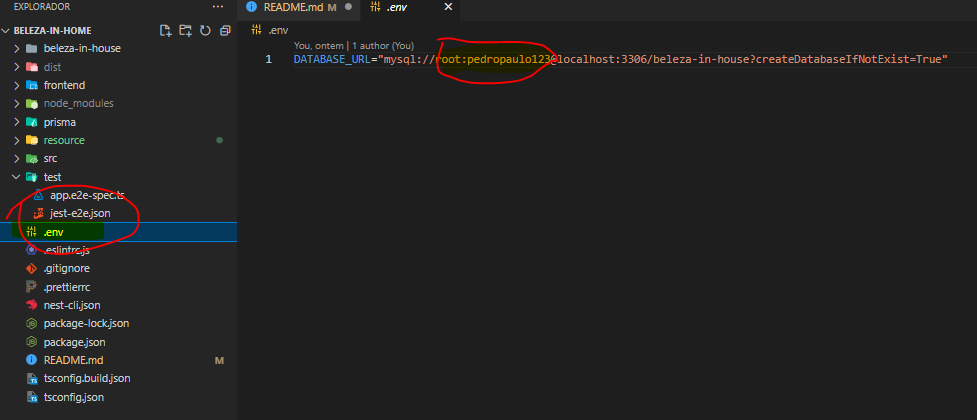
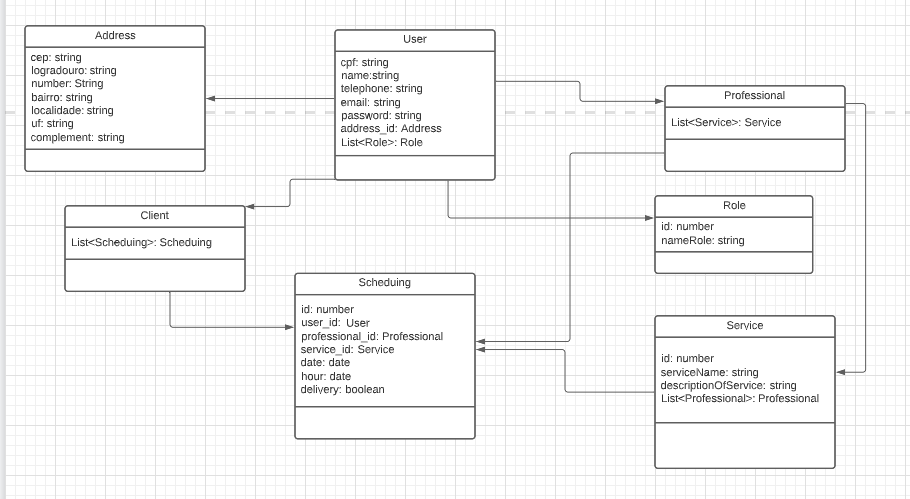
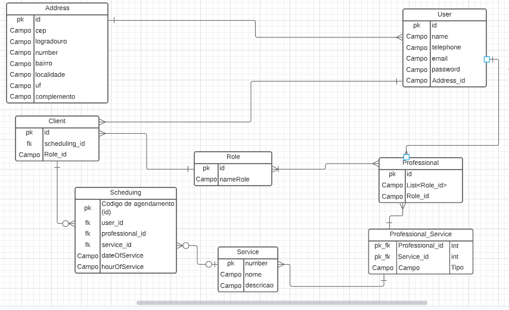
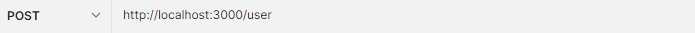
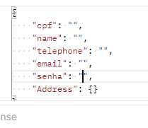
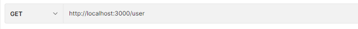
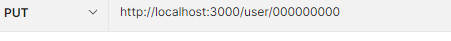
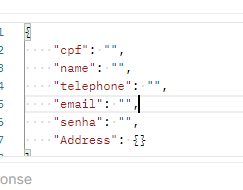
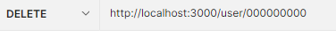

# Documentação da API - Beleza in Home #

### Questões tecnicas ###

1. O projeto está sendo estruturado com NestJs 

2. O ORM que está sendo utilizado é o Prisma

3. Banco de dados que está configurado é o MySql
  - Caminho para alterar as credencias para acessar o banco, deve alterar as informações da URL que esta dentro do arquivo **.env**

  

### Diagramas do Projeto ###

1. Diagrama de classes 

2. Diagrama de Relacionamento

## EndPoint - User ## 

1. End Point para cria o user 

Modelo do arquivo JSON para realizar o cadastro 

2. End Point para buscar todos os usuarios cadastrados

3. End Point para buscar cadastros pelo cpf

4. End Point para atualizar cadastro

A busca do cadastro será feita pelo cpf 

E o json por enquanto segue o mesmo padrao do criar, irei criar um dto mais estruturado para ele 

5. End Point do delete

Será feita o delete apartir do cpf do usuario 

